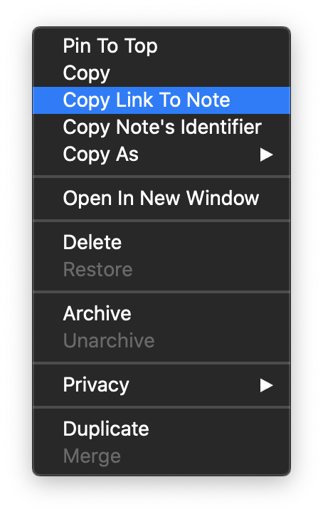

# Remarks on the implementation 

There are several insteresting things in this problem, the main one for now I think is the following.

## Ignore back references when creating new back references

It's not that simple to implement this feature as it require to make a distinction between:

* *Normal links* existing links to notes you added yourself.
* *Back reference links* automatically added by the script. 

There are several constraints to implement this, but mainly we need back references links 
to have any title the end-user may want. We also want links added by previous versions of
this script be detected as back references.

The problem is we can't add hidden content in Bear note so the program can interpret these.
In other words we don't have access to any sort of meta-data mechanism. 

### The solution 

Luckily there is a way to have meta-data within Bear (notes) links. The [open-note API][open-note]
has two mechanism: (i) reference a note with its title, (ii) reference a note using its unique
identifier. 


**Observation 1** Internally, Bear only uses references to link to other notes: 

<div align="center"></div>


This generate the following markdown-link to note with **ID 1** (real identifiers are way longer):

```markdown
[Note A](bear://x-callback-url/open-note?id=1)
```

**Observation 2** ID always prevail over title when both are provided in `open-note`.
Which mean we can use the title to add some extra information, some meta-data to the link.

```markdown
[Note A](bear://x-callback-url/open-note?id=1&title=this_is_ignored_by_bear)
```

Giving these two observation we just need to add a string identifier, a marker, to the title option
to be able to automatically recognize back reference:

```python 
BACKREFMARKER = "__backreference_link__"

# Every automatically created link will have this property stored in:
backref = Link(href_id=note.uid, title=note.title, open_note_title=BACKREFMARKER)

# Which we will then output (in markdown), like so:
def markdown_link(link):
    api_url = "bear://x-callback-url/open-note?id={link.href_id}&title={link.open_note_title}"
    return f"[{link.title}]({api_url})"
```

For example, this code produces links like: 

```markdown
[Note A](bear://x-callback-url/open-note?id=1&title=__backreference_link__)
```

Identifying back references then becomes trivial:

```python
def is_a_backreference(link):
    try:
        return link.open_note_title == BACKREFMARKER
    except AttributeError:
        return False
```

There is one limitation to that solution, if anyone manually create a link (in `note B`) to a note whose title is
`__backreference_link__` then this link will be ignored by our algorithm. Which means that the (strange)
note with title `__backreference_link__` will not contain a back reference to `note B`. This could probably 
be prevented by simply giving `BACKREFMARKER` a value that can't appear in a valid title (markdown standard). 
That's to be tested but I think that's possible.

[open-note]: https://bear.app/faq/X-callback-url%20Scheme%20documentation/#open-note
