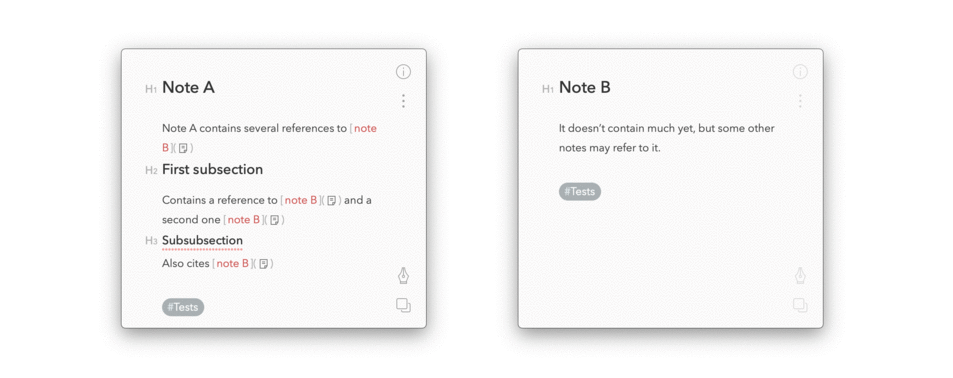
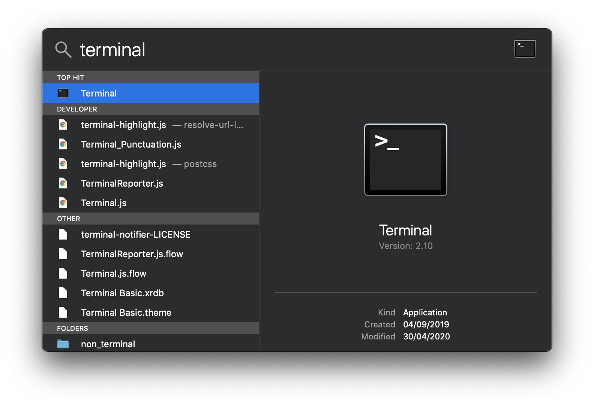
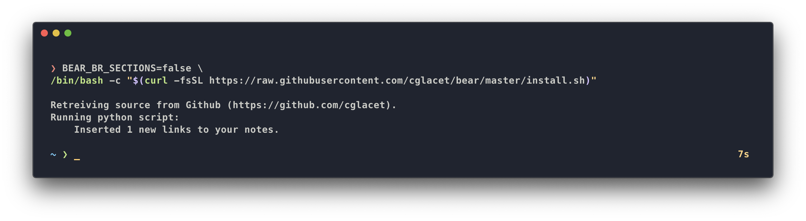
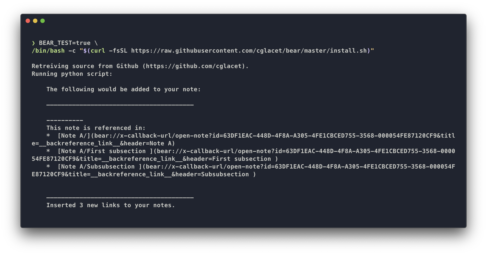

# Automatically add back-references to all your Bear notes

* :warning: Make sure to backup your notes before trying this, or just try it in [test mode](#use-in-test-mode).
* :date: This will change modification dates of the modified notes (I would like to solve this and asked for help [here][help needed]).

**Back references to notes**
```bash
BEAR_BR_SECTIONS=false \
/bin/bash -c "$(curl -fsSL https://raw.githubusercontent.com/cglacet/bear/master/install.sh)"
```
<div align="center"></div>

**Back references to sections**
```bash
/bin/bash -c "$(curl -fsSL https://raw.githubusercontent.com/cglacet/bear/master/install.sh)"
```
<div align="center"></div>


## Running commands in your terminal

**How to run a bash command on OSX**: 
Bring spotlight search in by hitting ``⌘ + space``, 
search for ``terminal`` 
and validate you search with ``↵ enter``. 

<div align="center"></div>

A terminal window shows up, 
copy paste any of the previous command `/bin/bash -c "..."` in the terminal 
then hit ``↵ enter`` to run the [bash][bash] script.

<div align="center"></div>

## Why

The suggestion comes from this [question][reddit post] on reddit: 

> There has been interest in this feature already with previous posts:
>
> * https://www.reddit.com/r/bearapp/comments/9sbx6h/feature_request_reverse_links_a_note_shows_all/
>
> * https://www.reddit.com/r/bearapp/comments/5hn8ts/feature_request_compile_all_note_mentionlinks_in/
>
> Is this feature on the near-future roadmap?
>
> I would absolutely love this for the [Zettelkasten tool](https://zettelkasten.de/) I want to build [based on Niklas Luhmann note scheme]. There are several dedicated software tools out there implementing ZTK specifically [nvALT, The Archive], but they all have downsides. For starters they are not cross platform macOS/iOS/iPadOS...]!
>
> Bear already supported the auto-link-complete feature with [[ notation...
>
> Having a note at the bottom of each note indication other notes that are linking to it would make Bear for me 'the perfect Zettelkasten' tool! And probably that of many others too. No problem if this would be subscription only feature... happy to pay for it, in fact it should be, otherwise the cross platform requirement would be moot ;)

## How

The script: 

```bash
/bin/bash -c "$(curl -fsSL https://raw.githubusercontent.com/cglacet/bear/master/install.sh)"
```

Here is what this script does:

* install all shell dependencies ([Git][Git] and [Python][Python]) using [Homebrew][Homebrew], 
* download the most recent sources from [here][sources],
* run the [python script][py script] that actually make all the work, which is: 
  * finding all outgoing links from existing notes
  * adding back-references to existing notes.


## Use in test mode

In test mode, nothing will happen to your notes. The script will only output what it would have 
added to your notes directly in the terminal. To use the test mode, simply set `BEAR_TEST=true`
before running the script: 

```bash
BEAR_TEST=true \
/bin/bash -c "$(curl -fsSL https://raw.githubusercontent.com/cglacet/bear/master/install.sh)"
```

The result will look like that:

<div align="center"></div>


## Customize the output

You can set environment variables to modify the output of this program. By default the markdown produced 
for back-references is the following: 

```markdown
---
Non-referenced incoming links: 

* [Title of the note](link-to-node)
* [Title of another note](link-to-another-node)
```

For example if we need to modify the introduction text you just need to run: 

```bash
BEAR_BACKREFERENCES_INTRO_TEXT="Liens entrants vers cette note :" \
/bin/bash -c "$(curl -fsSL https://raw.githubusercontent.com/cglacet/bear/master/install.sh)"
```

Which will render the following markdown: 

```markdown
---
Liens entrants vers cette note : 

* [Title of the note](link-to-node)
* [Title of another note](link-to-another-node)
```

If you need to have several options:

```bash
BEAR_BR_SECTIONS=false \
BEAR_BACKREFERENCES_INTRO_TEXT="# References" \
BEAR_BACKREFERENCES_SECTION="" \
/bin/bash -c "$(curl -fsSL https://raw.githubusercontent.com/cglacet/bear/master/install.sh)"
```

```markdown
# References

* [Title of the note](link-to-node)
* [Title of another note](link-to-another-node)
```

## Complete documentation on environment variable options 


| environment variable                   | target/effect                     | default value                       |
|----------------------------------------|-----------------------------------|-------------------------------------|
| `BEAR_BACKREFERENCES_SEPARATOR`        | separator                         | `---`                               |
| `BEAR_BACKREFERENCES_INTRO_TEXT`       | introduction text                 | `This note is referenced in:`       |
| `BEAR_BACKREFERENCE_PREFIX`            | prefix of each link               | `\n* `                              |
| `BEAR_ROOT_SECTION_TEXT`               | root section representation       | `/`                                 |
| `BEAR_BR_SECTIONS`                     | link back references to sections  | true                                |
| `BEAR_TEST`                            | output text in terminal           | false                               |


## If you have more questions

If you are a developer, maybe you can read the [implementation notes](IMPLEMENTATION.md).
Also, any comment is welcome, feel free to [open a new issue][new issue] (even for discussions).


[bash]: https://www.wikiwand.com/en/Bash_(Unix_shell)
[reddit post]: https://www.reddit.com/r/bearapp/comments/gc2ywl/reverselinks_support/
[Homebrew]: https://brew.sh/
[Python]: https://www.python.org/
[Git]: https://git-scm.com/
[sources]: https://github.com/cglacet/bear
[py script]: https://github.com/cglacet/bear/blob/master/insert_backreferences.py
[new issue]: https://github.com/cglacet/bear/issues/new/choose
[help needed]: https://www.reddit.com/r/bearapp/comments/gepb5x/addtext_api_without_altering_modification_date/?utm_source=share&utm_medium=web2x
