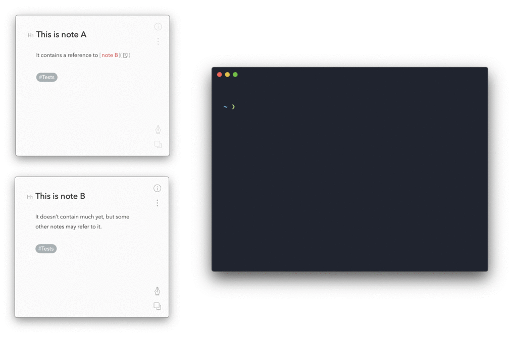

# Automatically add back-references to all your Bear notes

<div style="text-align:center"></div>

## Add all back-references

**In a terminal** — :warning: Make sure to backup your notes before trying this

```bash
/bin/bash -c "$(curl -fsSL https://raw.githubusercontent.com/cglacet/bear/master/insert_in_links.sh)"
```

> **Beginer tip**: run a bash command on OSX. 
> Bring spotlight search in by hitting ``⌘ + space``, 
> search for ``terminal`` 
> and validate you search with ``↵ enter``. 
> A terminal window shows up, 
> copy paste the previous command in the terminal 
> then hit ``↵ enter`` to run the [bash][bash] script.


## Customize the output

You can set environment variables to modify the output of this program. By default the markdown produced 
for back-references is the following: 

```markdown
---
Non-referenced incoming links: 

* [Title of the note](link-to-node)
* [Title of another note](link-to-another-node)
```

You can modify three things: 

* The separator (`---`)
* The introduction text (`Non-referenced incoming links`) 
* A prefix to each link (`* `)

Each of which can respectively be modified with the following environment variables: 

* `BEAR_IN_LINKS_SECTION`, 
* `BEAR_IN_LINKS_INTRO_TEXT`, 
* `BEAR_IN_LINK_PREFIX`. 

For example if we need to modify the introduction text we just need to run: 

```bash
BEAR_IN_LINKS_INTRO_TEXT="Liens entrants vers cette note :" \
/bin/bash -c "$(curl -fsSL https://raw.githubusercontent.com/cglacet/bear/master/insert_in_links.sh)"
```

Which will render the following markdown: 

```markdown
---
Liens entrants vers cette note : 

* [Title of the note](link-to-node)
* [Title of another note](link-to-another-node)
```

> **TODO** For now this is the part that doesn't work as I would like to, I have no smart 
> way of telling if the back-references section has already been added to a document and 
> I use `BEAR_IN_LINKS_INTRO_TEXT` text to detect whether it's the case or not. 

## Why

The suggestion comes from this [question][reddit post] on reddit: 

> There has been interest in this feature already with previous posts:
>
> * https://www.reddit.com/r/bearapp/comments/9sbx6h/feature_request_reverse_links_a_note_shows_all/
>
> * https://www.reddit.com/r/bearapp/comments/5hn8ts/feature_request_compile_all_note_mentionlinks_in/
>
> Is this feature on the near-future roadmap?
>
> I would absolutely love this for the [Zettelkasten tool](https://zettelkasten.de/) I want to build [based on Niklas Luhmann note scheme]. There are several dedicated software tools out there implementing ZTK specifically [nvALT, The Archive], but they all have downsides. For starters they are not cross platform macOS/iOS/iPadOS...]!
>
> Bear already supported the auto-link-complete feature with [[ notation...
>
> Having a note at the bottom of each note indication other notes that are linking to it would make Bear for me 'the perfect Zettelkasten' tool! And probably that of many others too. No problem if this would be subscription only feature... happy to pay for it, in fact it should be, otherwise the cross platform requirement would be moot ;)

## What 

In Bear note it's possible to have hyperlinks to other notes, for example, ``note A`` may have a link to some ``note B``.
In that case it may be interesting for ``note B`` to display a reference back to all notes referencing it, here ``note A``.

Running the following script will add all back references found in your notes.


## How

The script: 

```bash
/bin/bash -c "$(curl -fsSL https://raw.githubusercontent.com/cglacet/bear/master/insert_in_links.sh)"
```

Here is what this script does:

* install all shell dependencies ([Git][Git] and [Python][Python]) using [Homebrew][Homebrew], 
* download the most recent sources from [here][sources],
* run the python script that actually make all the work, which is: 
  * finding all outgoing links from existing notes
  * adding back-references to existing notes.

[bash]: https://www.wikiwand.com/en/Bash_(Unix_shell)
[reddit post]: https://www.reddit.com/r/bearapp/comments/gc2ywl/reverselinks_support/
[Homebrew]: https://brew.sh/
[Python]: https://www.python.org/
[Git]: https://git-scm.com/
[sources]: https://github.com/cglacet/bear
